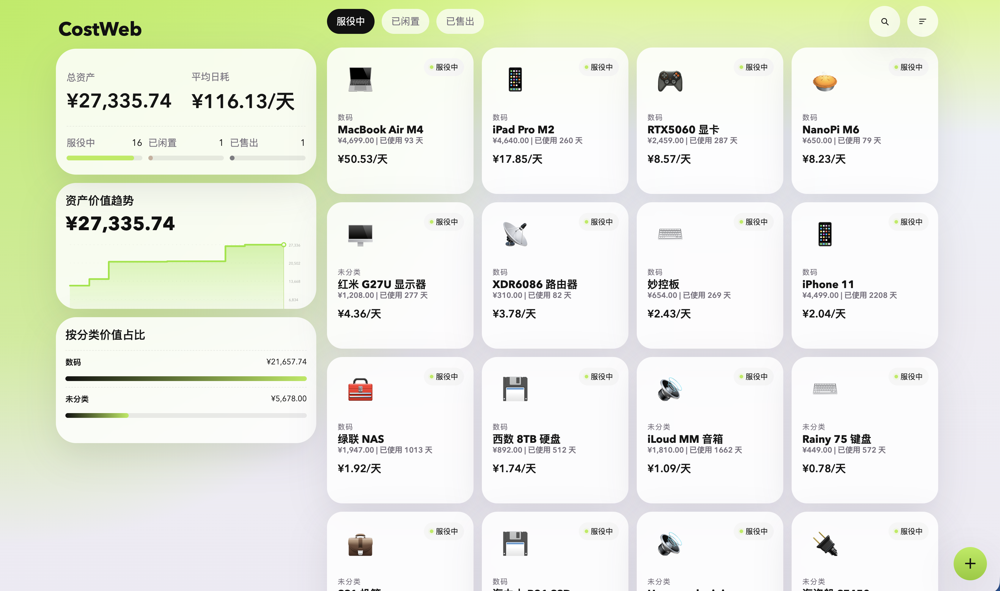
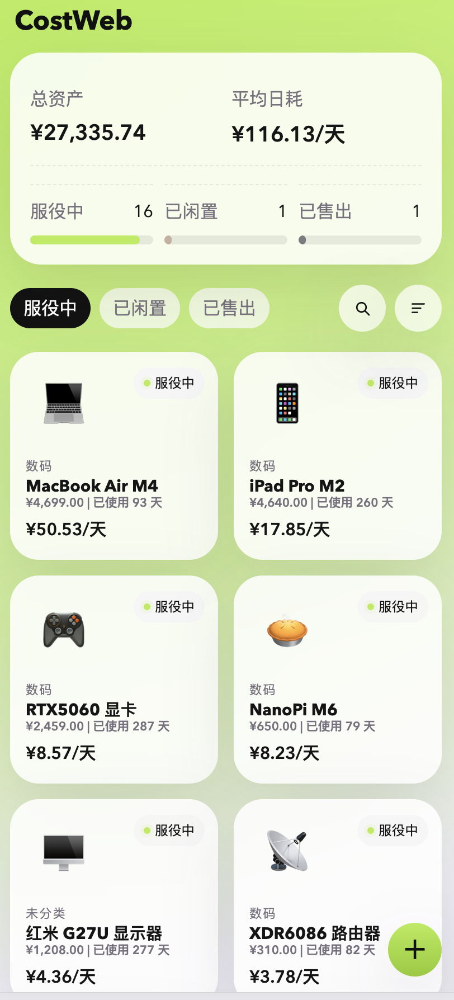

# 资产看板

一个模仿“有数”逻辑的轻量 Web 应用，后端使用 Go + SQLite，前端使用原生 HTML/CSS/JS。

## 功能

- 资产录入：名称、分类、购入价格、购入日期、预期使用年限或目标日耗
- 资产编辑与删除：同一表单支持更新与移除资产
- 日均成本：按购入日至今天数实时计算
- 资产状态：服役中、已闲置、已售出，支持售出价格与售出日期
- 生命周期进度：按预期年限或目标日耗反推预计总天数并显示进度
- 总览统计：总资产、平均日耗、状态数量分布
- 分类统计：按分类聚合数量、总价值、平均日耗
- 图表页：分类价值条形图与月度购入趋势图





## 运行

```bash
go run .
```

默认访问地址：

```text
http://localhost:8080
```

## 测试

```bash
env GOCACHE=/tmp/go-build go test ./...
```

## Docker

```bash
docker run -d \
  --name costweb \
  -p 8085:8080 \
  -v $(pwd)/data:/app/data \
  -e DB_PATH=/app/data/assets.db \
  q000q000/costweb:latest
